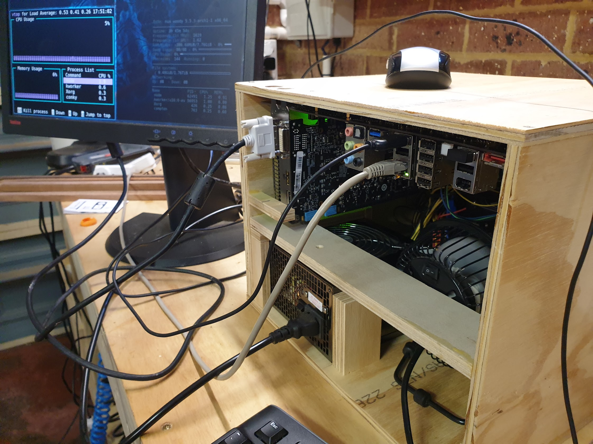

# woody

Plywood PC box for old kit. 

Just because its a bad idea, does not mean that you should not do it.

A simple py box cobbled together from scraps and old PC kit that became
available after a upgrade. 

